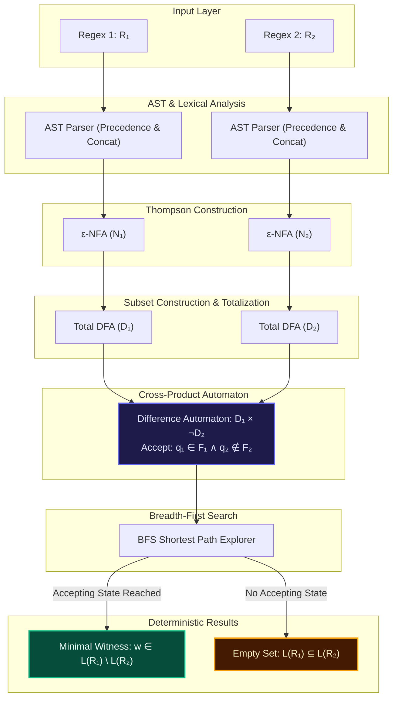

<div align="center">

# ⚡ REGEX DIFFERENCE EVALUATOR

### Deterministic Regular Language Difference $\mathcal{L}(R_1) \setminus \mathcal{L}(R_2)$ & Witness Discovery Engine

[](https://react.dev/)
[](https://www.typescriptlang.org/)
[](https://vitejs.dev/)
[](https://tailwindcss.com/)
[](https://reactflow.dev/)
[](LICENSE)

<p align="center">
  <strong>TAE1 Project Based Learning · Theory of Automata & Formal Languages</strong>
</p>

```
  ____  ____  _____     _____             _             _             
 |  _ \|  _ \| ____|   | ____|_   ____ _ | |_   _  __ _| |_ ___  _ __ 
 | |_) | | | |  _|     |  _| \ \ / / _` || | | | |/ _` | __/ _ \| '__|
 |  _ <| |_| | |___    | |___ \ V / (_| || | |_| | (_| | || (_) | |   
 |_| \_\____/|_____|   |_____| \_/ \__,_||_|\__,_|\__,_|\__\___/|_|   
```

---

</div>

## 📌 Executive Summary

Given two regular expressions $R_1$ and $R_2$, this application mathematically determines and witnesses a minimal-length sample string $w$ such that:

$$w \in \mathcal{L}(R_1) \quad \text{AND} \quad w \notin \mathcal{L}(R_2)$$

This is equivalent to finding a member in the set-theoretic difference:

$$\mathcal{L}(R_1) \setminus \mathcal{L}(R_2) = \mathcal{L}(R_1) \cap \overline{\mathcal{L}(R_2)}$$

If no such string exists (i.e., $\mathcal{L}(R_1) \subseteq \mathcal{L}(R_2)$), the engine formally establishes that $\mathcal{L}(R_1) \setminus \mathcal{L}(R_2) = \emptyset$.

---

## 🌟 Key Highlights

- 🧠 **100% In-Browser Engine**: Zero backend servers, zero Python/C++ microservices. Runs purely client-side with deterministic algorithms.
- 📐 **Rigorous Automata Pipeline**:
  1. **AST Parser**: Recursive-descent parser with precedence, explicit concatenation injection (`·`), and helpful error diagnostics.
  2. **Thompson's Construction**: Inductively builds linear-bounded $\varepsilon$-NFAs ($N_1, N_2$).
  3. **Subset Construction with Totalization**: Computes $\varepsilon$-closures over unified alphabet $\Sigma_1 \cup \Sigma_2$ with explicit dead states ($q_{\text{dead}}$).
  4. **Cross-Product Automaton**: Constructs reachable state space of $D_1 \times \overline{D_2}$ where accepting states satisfy $q_1 \in F_1 \land q_2 \notin F_2$.
  5. **Breadth-First Search (BFS)**: Explores shortest paths level-by-level, mathematically guaranteeing a **minimal-length witness**.
- 🕸️ **Interactive Automata Visualizer**: Powered by `@xyflow/react` and `@dagrejs/dagre` with hierarchical Dagre layout, state inspection drawer, zoom/pan controls, and visual witness path highlighting.
- 🧪 **Arbitrary String Sandbox**: Type any test string to simulate its step-by-step state transition trajectory through $D_1$ and $D_2$ simultaneously.
- 📋 **Academic Test Suite**: One-click verification across 10 academic presets and malformed syntax diagnostics.
- 🚀 **One-Click Local Launcher**: High-tech `start.bat` script that checks runtime environment, auto-installs dependencies, and opens the browser automatically.

---

## 🏗️ Algorithmic Pipeline Architecture



---

## 📖 Supported Regular Expression Grammar

| Operator | Syntax | Description | Example |
| :--- | :---: | :--- | :--- |
| **Literal Characters** | `a-z`, `A-Z`, `0-9` | Alphabet symbols $\sigma \in \Sigma$ | `a`, `b`, `1` |
| **Empty String (Epsilon)** | `ε`, `\e` | Language $\mathcal{L} = \{ \varepsilon \}$ | `a\|ε` |
| **Parentheses Grouping** | `(R)` | Overrides operator precedence | `(a\|b)*` |
| **Kleene Star** | `R*` | Zero or more repetitions ($\ge 0$) | `a*` |
| **Kleene Plus** | `R+` | One or more repetitions ($\ge 1$) | `a+` |
| **Optional Operator** | `R?` | Zero or one occurrence ($R \mid \varepsilon$) | `a?b` |
| **Concatenation** | `AB` | Sequential juxtaposition ($A \cdot B$) | `ab` |
| **Alternation (Union)** | `A\|B` | Set union ($\mathcal{L}(A) \cup \mathcal{L}(B)$) | `a\|b` |
| **Escaped Symbols** | `\*`, `\+`, `\|`, `\?`, `\(`, `\)` | Literal symbols | `\*` |

---

## 🔬 Computational Complexity

| Phase | Mathematical Operation | Time Complexity | Space Complexity |
| :--- | :--- | :---: | :---: |
| **1. Lexing & AST Parsing** | Recursive Descent with Lookahead | $\mathcal{O}(\|R\|)$ | $\mathcal{O}(\|R\|)$ |
| **2. Thompson NFA** | Inductive $\varepsilon$-NFA Graph Construction | $\mathcal{O}(\|R\|)$ | $\mathcal{O}(\|R\|)$ |
| **3. Subset Construction** | Powerset DFA over Unified Alphabet $\Sigma$ | $\mathcal{O}(2^{\|Q_{\text{NFA}}\|} \cdot \|\Sigma\|)$ | $\mathcal{O}(2^{\|Q_{\text{NFA}}\|})$ |
| **4. Product Automaton** | Reachable Cartesian State Graph $D_1 \times \overline{D_2}$ | $\mathcal{O}(\|Q_1\| \cdot \|Q_2\| \cdot \|\Sigma\|)$ | $\mathcal{O}(\|Q_1\| \cdot \|Q_2\|)$ |
| **5. BFS Witness Search** | Level-Order Queue State Exploration | $\mathcal{O}(\|V_{\text{diff}}\| + \|E_{\text{diff}}\|)$ | $\mathcal{O}(\|V_{\text{diff}}\|)$ |

---

## ⚡ Quick Start

### Option A: One-Click Launch (Windows)
Double-click `start.bat` or run:
```cmd
.\start.bat
```
*This verifies Node.js, installs dependencies if needed, starts Vite, and automatically opens your browser at `http://localhost:5173`.*

---

### Option B: Manual Setup

```bash
# 1. Clone the repository
git clone https://github.com/your-username/regex-difference-evaluator.git
cd regex-difference-evaluator

# 2. Install dependencies
npm install

# 3. Start development server
npm run dev

# 4. Open browser
# Navigate to http://localhost:5173
```

---

## 🧪 Automated Testing & Diagnostics

Run the integrated linter and build test:
```bash
# Run oxlint across all TypeScript files
npm run lint

# Build production bundle with TypeScript type-checking
npm run build
```

---

## 📂 Project Structure

```text
regex-difference-evaluator/
├── public/
│   └── _redirects              # Netlify SPA client routing rules
├── src/
│   ├── algorithms/             # Pure Automata & Computational Theory Engine
│   │   ├── types.ts            # AST, NFA, DFA, and Product Graph interfaces
│   │   ├── tokenizer.ts        # Lexer with explicit concatenation (·) injection
│   │   ├── parser.ts           # Recursive-descent AST parser with diagnostics
│   │   ├── thompson.ts         # Thompson's Construction (AST -> ε-NFA)
│   │   ├── subsetConstruction.ts # Subset Construction with totalization (NFA -> DFA)
│   │   ├── differenceAutomaton.ts# Product Automaton (D1 × ¬D2)
│   │   ├── bfs.ts              # BFS level-order shortest witness search
│   │   ├── witnessVerifier.ts  # Independent Dual-DFA step-by-step simulator
│   │   ├── evaluator.ts        # End-to-end pipeline orchestrator
│   │   └── testRunner.ts       # Standalone automated test suite
│   ├── components/
│   │   ├── automata/           # React Flow interactive graph visualizer
│   │   │   ├── AutomataNode.tsx       # Custom styled automata node with badges
│   │   │   └── AutomataVisualizer.tsx # Multi-tab NFA/DFA/Diff visualizer
│   │   ├── common/             # Navigation, Footer, Syntax Cheat Sheet
│   │   └── evaluator/          # Editors, Result Card, Sandbox, BFS Timeline
│   ├── data/
│   │   └── presets.ts          # Academic presets & malformed syntax test cases
│   ├── pages/
│   │   ├── HomePage.tsx        # Hero, set theory interactive card, pipeline
│   │   ├── EvaluatorPage.tsx   # Core interactive workspace
│   │   ├── AutomataPage.tsx    # Full-screen multi-automaton inspector
│   │   ├── TestCasesPage.tsx   # Automated 10-test academic benchmark runner
│   │   └── TheoryPage.tsx      # Formal proofs & TAE1 academic specifications
│   ├── utils/
│   │   └── graphLayout.ts      # Dagre layout generator for React Flow
│   ├── App.tsx                 # Top-level state & tab router
│   ├── index.css               # Tailwind CSS & custom dark scrollbars
│   └── main.tsx                # Application DOM root
├── index.html                  # HTML5 entrypoint with SEO tags
├── start.bat                   # High-tech Windows console launcher
├── vite.config.ts              # Vite + React + Tailwind Vite configuration
└── package.json                # Project dependencies and npm scripts
```

---

## 🌐 Production Deployment (Netlify Ready)

The project is pre-configured for instant zero-configuration deployment to **Netlify**:
1. **Build Command**: `npm run build`
2. **Publish Directory**: `dist`
3. Single-page client routing is handled automatically via `public/_redirects`.

---

## 🎓 Academic Context

- **Course**: Theory of Automata & Formal Languages
- **Assignment**: TAE1 — Project Based Learning
- **Institution**: Computer Science & Engineering
- **Objective**: Design, formulate, and implement a rigorous automata-based solver for the regular language relative complement problem.

---

<div align="center">
  <sub>Built with ❤️ for Computer Science & Theory of Computation students.</sub>
</div>
